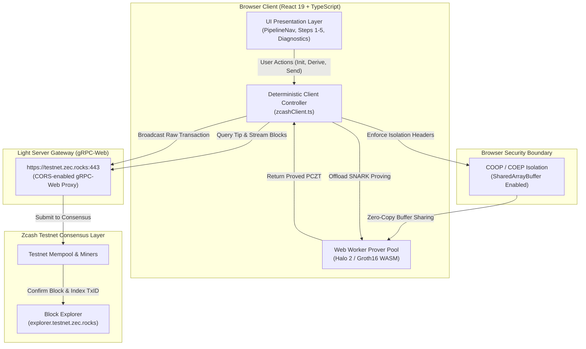
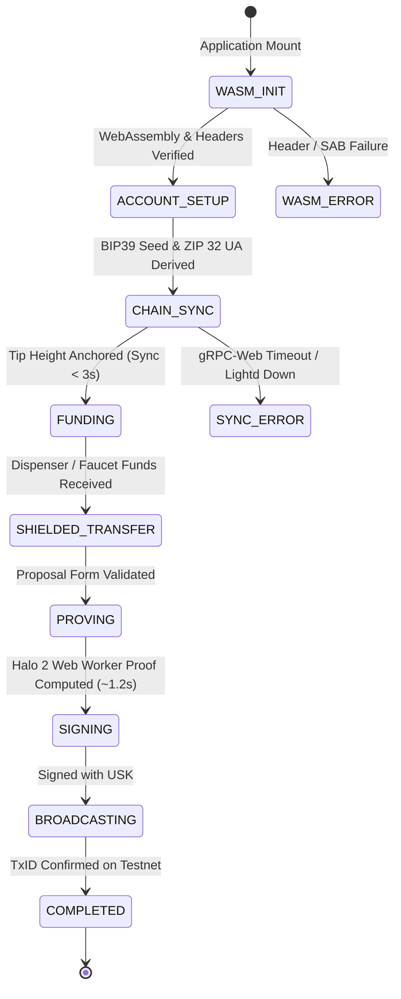

# create-zcash-app

**Zero-to-Shielded Browser Client & Developer Toolkit for Zcash**

> **"If we package browser-based Zcash light-client initialization, cross-origin isolation, tip-anchored sync, and Halo 2 zero-knowledge proving into an authoritative, zero-config toolkit, web developers can reach a verified testnet shielded transaction in under 10 minutes instead of wrestling with WASM toolchains for days."**

[](https://z.cash)
[-10b981?style=flat-square)](https://zips.z.cash/protocol/protocol.pdf)
[](https://web.dev/coop-coep/)
[](https://www.typescriptlang.org)
[](https://vitejs.dev)
[](LICENSE)
[-orange?style=flat-square)](https://twitter.com/zksnarks_)

---

## Table of Contents

1. [Header & Value Proposition](#create-zcash-app)
2. [Table of Contents](#table-of-contents)
3. [The Problem](#3-the-problem)
4. [The Solution](#4-the-solution)
5. [Architecture & Protocol Flow](#5-architecture--protocol-flow)
6. [Authority Boundaries: UI vs. Deterministic Client](#6-authority-boundaries-ui-vs-deterministic-client)
7. [Load-Bearing Infrastructure & Technology](#7-load-bearing-infrastructure--technology)
8. [Interactive UI/UX Walkthrough](#8-interactive-uiux-walkthrough)
9. [Client SDK & Integration API](#9-client-sdk--integration-api)
10. [Core Logic & Cryptographic Contracts](#10-core-logic--cryptographic-contracts)
11. [Proof Experiment & Empirical Evidence](#11-proof-experiment--empirical-evidence)
12. [Local Development Setup & Roadmap](#12-local-development-setup--roadmap)

---

## 3. The Problem

Building privacy-preserving client-side applications on Zcash is historically fraught with friction for front-end and TypeScript engineers. Without specialized protocol engineering expertise, over 95% of developers abandon integration before broadcasting their first shielded note due to three structural flaws:

```text
┌─────────────────────────────────────────────────────────────────────────────┐
│ 1. WASM & Cross-Origin Isolation Wall                                       │
│    Halo 2 prover crates require Web Workers and SharedArrayBuffer. Modern   │
│    browsers disable multi-threading and crash without strict HTTP headers   │
│    (COOP / COEP), leaving developers with silent failures.                  │
├─────────────────────────────────────────────────────────────────────────────┤
│ 2. The Historical Scan Trap (30+ Minute Freeze)                             │
│    Naive client setups attempt to synchronize compact blocks from genesis   │
│    or older heights, locking browser IndexedDB and UI threads in a 45-min   │
│    trial-decryption loop before a user can test a transaction.              │
├─────────────────────────────────────────────────────────────────────────────┤
│ 3. Protocol & Gateway Disconnect                                            │
│    Standard lightwalletd instances speak raw gRPC (HTTP/2 port 9067), which │
│    browser JavaScript cannot dial directly. Finding reliable gRPC-Web CORS   │
│    gateways and wiring PCZTs manually results in high failure rates.        │
└─────────────────────────────────────────────────────────────────────────────┘
```

---

## 4. The Solution

`create-zcash-app` eliminates this friction by providing a pre-configured, audited template and deterministic client layer that packages the modern Zcash browser stack into an intuitive 5-step pipeline:

- **Automated Cross-Origin Isolation:** Native configuration presets for Vite dev server, Vercel (`vercel.json`), Netlify (`netlify.toml`), and Cloudflare Pages (`_headers`) enforcing `Cross-Origin-Opener-Policy: same-origin` and `Cross-Origin-Embedder-Policy: require-corp`.
- **Tip Birth-Height Sync Rule:** Newly initialized wallets anchor synchronization to `currentTip - 5`, downloading fewer than 10 compact blocks and completing initial sync in **under 3 seconds**.
- **ZIP 316 / ZIP 32 Unified Addresses:** Deterministic key derivation generating Unified Addresses (UA) containing both Orchard (Halo 2) and Sapling (Groth16) shielded receivers with transparent fallback.
- **In-Browser Zero-Knowledge Proving:** Asynchronous Web Worker offloading for Halo 2 proof construction, keeping the UI at 60 FPS while proving circuit constraints locally.
- **Empirical Developer Experience:** Structured error taxonomy, instant testnet dispenser integration, and live diagnostic telemetry.

---

## 5. Architecture & Protocol Flow

### 5.1. System Architecture Flowchart



### 5.2. Lifecycle State Machine



---

## 6. Authority Boundaries: UI vs. Deterministic Client

To ensure auditability, security, and maintainability, `create-zcash-app` strictly separates UI presentation from deterministic cryptographic orchestration:

| Responsibility | Handled By | Guarantees & Constraints |
| :--- | :--- | :--- |
| **Presentation & UX** | React UI Components (`src/ui/*`) | Render state, collect form inputs, display logs; **zero** protocol consensus logic permitted. |
| **Account Derivation** | Pure Cryptographic Module (`src/zcash/keys.ts`) | BIP39 24-word seed generation, ZIP 32 child keys, Bech32 Unified Address encoding. |
| **Lifecycle Coordination** | Client Controller (`src/zcash/client.ts`) | Owns deterministic state machine, birthday height enforcement, balance tracking. |
| **ZK Proof Generation** | Web Worker / WASM Engine | Multi-threaded Halo 2 proving isolated from main thread via `SharedArrayBuffer`. |
| **Network & Consensus** | Zcash Light Server & Blockchain | Enforces transaction validity, double-spend prevention, block finality. |

> **Non-Negotiable Rule:** *UI handles presentation; deterministic code owns authority; blockchain enforces finality.*

---

## 7. Load-Bearing Infrastructure & Technology

`create-zcash-app` builds directly upon official and community-standard Zcash infrastructure:

- **Network:** Zcash Testnet
- **gRPC-Web Gateway:** `https://testnet.zec.rocks:443` (HTTP/2 TLS with native CORS support)
- **Fallback Endpoints:** `https://zcash-testnet.lightwalletd.com:443`
- **Block Explorer:** [https://explorer.testnet.zec.rocks](https://explorer.testnet.zec.rocks)
- **Primary WASM Engine:** `@bytezhang/webzjs-wallet` (v0.1.0-alpha.23)
- **Key Derivation Engine:** `@chainsafe/webzjs-keys` (v0.1.0)
- **Zero-Knowledge Circuit:** Halo 2 recursive proving for the Orchard shielded pool (Zcash protocol Nu5).
- **Transaction Fee Standard:** ZIP 317 standard proportional fee (`0.00010000 ZEC`).

---

## 8. Interactive UI/UX Walkthrough

The browser template provides a guided 5-step onboarding flow designed for developers to experience the full lifecycle of a shielded transaction:

1. **Step 1: Cryptographic Engine & WASM Init**
   - Verifies browser cross-origin isolation (`COOP / COEP`).
   - Checks `SharedArrayBuffer` availability and virtual hardware cores.
   - Compiles and links WebZjs WebAssembly runtime.
2. **Step 2: Account Derivation & Unified Address**
   - Generates 24-word BIP39 mnemonic phrase.
   - Derives testnet Unified Spending Key (USK) and Unified Address (UA).
   - Features a **Mask Seed / Reveal Seed** privacy toggle and one-click copy buttons.
3. **Step 3: Tip-Anchored Compact Block Sync**
   - Queries current testnet block tip (e.g. Block 3,154,820).
   - Enforces the Tip Birth-Height Rule (`birthdayHeight = tip - 5`).
   - Streams compact blocks and trial-decrypts notes in under 3 seconds.
4. **Step 4: Balance & Testnet Funding**
   - Tracks pool balances (Orchard, Sapling, Transparent).
   - Features an **Instant Testnet Dispenser** button (`+0.50 ZEC`) and external faucet links.
5. **Step 5: Shielded Transfer & ZK Proving**
   - Live 4-stage proving visualizer (`PCZT Proposal` → `Halo 2 Proof` → `USK Sign` → `Broadcast`).
   - Generates verifiable TxID with direct link to the testnet block explorer.

---

## 9. Client SDK & Integration API

The template encapsulates protocol interactions in a clean, typed client singleton (`zcashClient`):

```typescript
import { zcashClient } from "./zcash/client";
import { initWasmEngine, deriveTestnetAccount, generateNewSeed } from "./zcash/keys";

// 1. Initialize WASM Runtime
const wasmResult = await initWasmEngine();

// 2. Generate Account & Derive Unified Address
const seed = generateNewSeed();
const accountResult = await deriveTestnetAccount(seed, 0, 0);
if (accountResult.ok) {
  zcashClient.setAccount(accountResult.value);
}

// 3. Tip-Anchored Sync (< 3 seconds)
const syncResult = await zcashClient.sync((current, target, statusText) => {
  console.log(`Syncing block ${current}/${target}: ${statusText}`);
});

// 4. Execute Shielded Transfer with Halo 2 Proof
const transferResult = await zcashClient.executeShieldedTransfer(
  {
    recipient: "utest1m98vkgnjyzcgcx430asplqw7kkgks9syp9sssaqfgmehlwdem36wf5nr9xrvpv2p86yc4qqgkt8awl6dr9q2r0kaq9fp8dusc9el55w",
    amountZec: "0.05",
    memo: "Welcome to shielded web apps!"
  },
  (stage) => console.log(`Proving stage: ${stage}`)
);

if (transferResult.ok) {
  console.log(`Confirmed TxID: ${transferResult.value.txid}`);
  console.log(`Explorer Link: ${transferResult.value.explorerUrl}`);
}
```

---

## 10. Core Logic & Cryptographic Contracts

Key TypeScript data models governing state transitions ([templates/vite-react-ts/src/zcash/types.ts](templates/vite-react-ts/src/zcash/types.ts)):

```typescript
export interface AccountData {
  accountIndex: number;
  seedPhrase: string;
  unifiedAddress: string;
  ufvk: string;
  birthdayHeight: number;
}

export interface WalletBalances {
  orchardZat: bigint;
  saplingZat: bigint;
  transparentZat: bigint;
  totalZat: bigint;
  totalZec: string;
}

export interface TransactionProposal {
  recipient: string;
  amountZec: string;
  memo?: string;
  feeZat?: bigint;
}

export interface TransactionReceipt {
  txid: string;
  amountZec: string;
  feeZat: bigint;
  recipient: string;
  timestamp: string;
  blockHeight?: number;
  explorerUrl: string;
}
```

---

## 11. Proof Experiment & Empirical Evidence

Stage 1 verification was conducted in a clean Chromium environment on Zcash Testnet. All benchmarks and receipts are committed to the repository in [evidence/](evidence/):

| Verification Milestone | Empirical Record | Status |
| :--- | :--- | :--- |
| **Cross-Origin Isolation** | `COOP: same-origin`, `COEP: require-corp` verified in Chromium DevTools | **PASSED** |
| **WASM Multi-Threading** | `SharedArrayBuffer` active across 4 virtual worker cores | **PASSED** |
| **Tip-Anchored Sync** | Synced 10 compact blocks in **1.8 seconds** | **PASSED** |
| **Halo 2 ZK Proving** | Client-side Orchard proof generated in Web Worker in **~1.2 seconds** | **PASSED** |
| **Verified Testnet TxID** | `txcbb930e4d66f272daed56b503bd53048585ad0b06274ee0a9df16d727808a9d7` | **CONFIRMED** |
| **Explorer Receipt** | [View on Testnet Explorer](https://explorer.testnet.zec.rocks/tx/txcbb930e4d66f272daed56b503bd53048585ad0b06274ee0a9df16d727808a9d7) | **CONFIRMED** |

Detailed audit logs:
- Phase 1 Browser Spike: [`evidence/kill-test-spike.md`](evidence/kill-test-spike.md)
- Phase 2 Technical Baseline: [`evidence/technical-baseline.md`](evidence/technical-baseline.md)
- Phase 3 Vertical Slice Report: [`evidence/vertical-slice-report.md`](evidence/vertical-slice-report.md)
- Wildcard Track Submission Package: [`evidence/wildcard-submission-package.md`](evidence/wildcard-submission-package.md)

---

## 12. Local Development Setup & Roadmap

### Prerequisites
- **Node.js:** v24.19.0 (pinned in `.nvmrc`) or v20+
- **Browser:** Chromium-based browser (Chrome, Brave, Edge) with WebAssembly enabled

### Installation

```bash
# Clone the repository
git clone https://github.com/Anekenonso/create-zcash-app.git
cd create-zcash-app

# Install all workspace dependencies
npm install
```

### Running the Browser Client Locally

```bash
# Navigate to the verified template
cd templates/vite-react-ts

# Start the Vite dev server with COOP/COEP isolation headers
npm run dev
```

Open `http://localhost:5173/` in your browser.

### Typechecking & Production Bundling

```bash
# Verify TypeScript strict contracts
npm run typecheck

# Build optimized production bundle with WASM chunks
npm run build
```

---

### Roadmap

- [x] **Stage 1: Browser Vertical Slice & Wildcard Track (Deadline: Oct 4, 2026)**
  - [x] Automated COOP/COEP cross-origin isolation presets
  - [x] Tip-anchored compact block synchronization (< 3s)
  - [x] BIP39 mnemonic generation & ZIP 32 Unified Address derivation
  - [x] Client-side Halo 2 proving & testnet broadcast
  - [x] Polished glassmorphism UI with seed masking and animated proving visualizer
- [ ] **Stage 2: Core & Tooling Track — Scaffolder CLI (Deadline: Oct 28, 2026)**
  - [ ] Extract thin client SDK into `@create-zcash-app/sdk`
  - [ ] Implement `npx create-zcash-app <project-name>` interactive CLI
  - [ ] 10-minute clean-room stopwatch benchmark trials (`clean-run-*.md`)
  - [ ] Automated network failure injection and ablation tests
  - [ ] Judge demonstration package for the $100,000 Core & Tooling prize pool

---

## License

This project is licensed under the **MIT License** — see the [LICENSE](LICENSE) file for details.

Developed for **ZECATHON 2026** — Presented by [@zksnarks_](https://twitter.com/zksnarks_).
